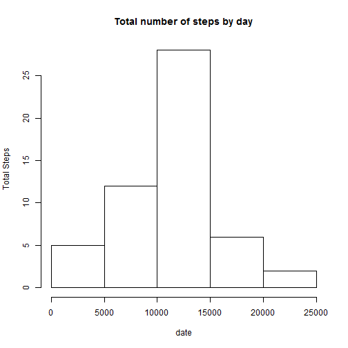
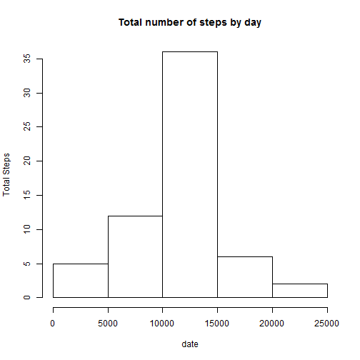

Reproducible Research : Peer Assessment 1
=========================================
Prepared by Hashin P Valsan

##Libraries used in the R code. 

```r
library(dplyr)
```

```
## Warning: package 'dplyr' was built under R version 3.2.2
```

```
## 
## Attaching package: 'dplyr'
## 
## The following objects are masked from 'package:stats':
## 
##     filter, lag
## 
## The following objects are masked from 'package:base':
## 
##     intersect, setdiff, setequal, union
```

```r
library(lattice)
```
##Loading and preprocessing the data

1.	Load the data (i.e. read.csv())

```r
filepath<- "./activity.csv"
activitydata <- read.csv(filepath, header = TRUE)
```

##What is mean total number of steps taken per day?
1.	Calculate the total number of steps taken per day

```r
sumbydate <- activitydata %>% filter(steps != "NA") %>% group_by (date) %>% summarize(StepsDay = sum (steps))
```
2.	Calculate and report the mean and median of the total number of steps taken per day


```r
# Histogram
hist(sumbydate$StepsDay, xlab = "date", ylab = "Total Steps", main = "Total number of steps by day")
```

 
Mean is 

```r
# Mean steps
meanSteps <- mean(sumbydate$StepsDay)
```

Median is 

```r
# Median Steps
medianSteps <- median(sumbydate$StepsDay)
```

##What is the average daily activity pattern?
1.	Make a time series plot (i.e. type = "l") of the 5-minute interval (x-axis) and the average number of steps taken, averaged across all days (y-axis)


```r
# timeseries
timeseriesdata <- tapply(activitydata$steps, activitydata$interval, mean, na.rm = TRUE)

# Plot
plot(row.names(timeseriesdata), timeseriesdata, type = "l", xlab = "5-min interval", 
     ylab = "Average across all Days", main = "Average number of steps taken", 
     col = "red")
```

 

2.	Which 5-minute interval, on average across all the days in the dataset, contains the maximum number of steps?


```r
# Max steps
maxsteps <- which.max(timeseriesdata)
names(maxsteps)
```

```
## [1] "835"
```

##Imputing missing values
Note that there are a number of days/intervals where there are missing values (coded as NA). The presence of missing days may introduce bias into some calculations or summaries of the data.
1.	Calculate and report the total number of missing values in the dataset (i.e. the total number of rows with NAs)
2.	Devise a strategy for filling in all of the missing values in the dataset. The strategy does not need to be sophisticated. For example, you could use the mean/median for that day, or the mean for that 5-minute interval, etc.
3.	Create a new dataset that is equal to the original dataset but with the missing data filled in.

```r
# Replacing NA

# Calculate the mean by interval
meanbyinterval <- activitydata %>% filter(steps != "NA") %>% group_by (interval) %>% summarize(meanbyinterval = mean (steps))

tsteps <- numeric()
for(i in 1:nrow(activitydata)){
    rowdata <- activitydata[i,]
    if (is.na(rowdata$steps)){
      steps <- subset(meanbyinterval, interval == rowdata$interval)$meanbyinterval
    }
    else
    {
      steps <- rowdata$steps
    }
    tsteps <- c(tsteps, steps)

}
cactivitydata <- activitydata
cactivitydata$steps <- tsteps
```


4.	Make a histogram of the total number of steps taken each day and Calculate and report the mean and median total number of steps taken per day. Do these values differ from the estimates from the first part of the assignment? What is the impact of imputing missing data on the estimates of the total daily number of steps?

```r
# Calculate the sum by date
sumbydate2 <- cactivitydata %>% filter(steps != "NA") %>% group_by (date) %>% summarize(StepsDay = sum (steps))
```
Histogram

```r
# Histogram
hist(sumbydate2$StepsDay, xlab = "date", ylab = "Total Steps", main = "Total number of steps by day")
```

 
Mean

```r
# Mean steps
meanSteps <- mean(sumbydate2$StepsDay)
```
Median

```r
# Median Steps
medianSteps <- median(sumbydate2$StepsDay)
```

##Are there differences in activity patterns between weekdays and weekends?

1.	Create a new factor variable in the dataset with two levels ??? ???weekday??? and ???weekend??? indicating whether a given date is a weekday or weekend day.
2.	Make a panel plot containing a time series plot (i.e. type = "l") of the 5-minute interval (x-axis) and the average number of steps taken, averaged across all weekday days or weekend days (y-axis). 


```r
# Getting weekday or weekend information

daylevel <- vector()
for (i in 1:nrow(cactivitydata)) {
  activity <- cactivitydata[i,]
  day <- weekdays(as.Date(activity$date))
  if (day == "Saturday") {
    daylevel[i] <- "Weekend"
  } else if (day == "Sunday") {
    daylevel[i] <- "Weekend"
  } else {
    daylevel[i] <- "Weekday"
  }
}
cactivitydata$daylevel <- daylevel
cactivitydata$daylevel <- factor(cactivitydata$daylevel)

meanbydate2 <- cactivitydata %>% group_by (daylevel, interval) %>% summarize(Stepsmean = mean (steps))

xyplot(Stepsmean ~ interval | daylevel, meanbydate2, type = "l", layout = c(1, 2), 
       xlab = "Interval", ylab = "Number of steps")
```

 
